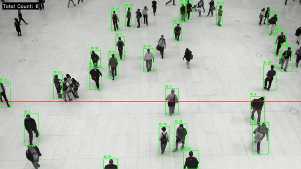

# 🚀 AI-Powered Real-Time Object Counting & Tracking


## 📖 Project Overview
This project is a high-performance **Computer Vision application** designed to detect, track, and count moving objects (people, vehicles, etc.) in real-time video streams.

It utilizes the state-of-the-art **YOLOv8** deep learning model for detection and implements a custom **tracking logic** to ensure accurate counting as objects cross a defined line. The system is optimized to run on **GPU (CUDA)** but automatically falls back to CPU if necessary.

### 🎥 Demo

*(The system tracking individuals and incrementing the counter upon crossing the line)*

---

## ✨ Key Features
* **Real-Time Detection:** Uses YOLOv8 Nano model for high-speed inference.
* **Object Tracking:** Implements ID persistence to prevent double-counting the same object.
* **Line Crossing Logic:** Counts objects only when they cross a specific coordinate, simulating real-world scenarios like store entries or traffic flow.
* **Hardware Acceleration:** Automatically detects NVIDIA GPUs (CUDA) for maximum performance.
* **Visual Dashboard:** Displays a live counter and bounding boxes on the output video.

---

## 🛠️ Technologies Used
* **Language:** Python 3.x
* **Core Libraries:**
    * `ultralytics` (YOLOv8 Object Detection)
    * `opencv-python` (Image Processing & Drawing)
    * `torch` (Deep Learning Backend)

---

## 🚀 How to Run

### 1. Clone the Repository
```bash
git clone [https://github.com/han5858/AI-Realtime-Object-Counting.git](https://github.com/han5858/AI-Realtime-Object-Counting.git)
cd AI-Realtime-Object-Counting
